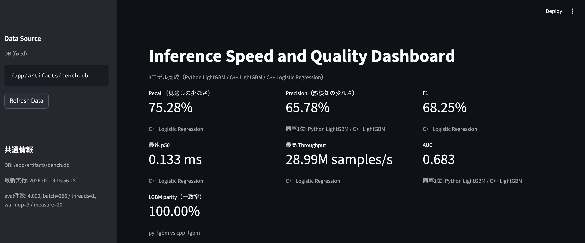

# Inference Speed and Quality Benchmark



このプロジェクトは、推論の **速度** と **精度** の関係を、次の3モデルで比較するWebアプリです。

- `py_lgbm`: Python LightGBM
- `cpp_lgbm`: C++ LightGBM predictor (同一LightGBMモデル)
- `cpp_lr`: C++ Logistic Regression

同じ評価データに対して、`Recall / Precision / F1 / Accuracy / AUC / p50 / p95 / Throughput / LGBM parity` と混同行列を並べて確認できます。

再現性のため、実行はDocker（docker compose）を前提にしています。

## TL;DR

- 何の比較：`py_lgbm` / `cpp_lgbm` / `cpp_lr` の速度（`p50/p95/throughput`）と品質（`Recall/Precision/F1/AUC`）
- どう動かす：`docker compose build` -> `docker compose run --rm demo` -> `docker compose up -d viz` -> `http://localhost:8501` -> `docker compose down`

## このアプリで分かること

- Python実装とC++実装の速度差
- LightGBM系とLogistic Regression系の精度差
- 速度と精度のバランスを運用目線で比較

## 結果の解釈に関する注意

- ダッシュボード上の順位は、実行時のデータ条件と評価条件に依存します。
- 既定のデータ設定での結果は、実データや別タスクで逆転する可能性があります。
- 比較は同一評価データ・同一計測条件（`batch_size / num_threads / warmup_iters / measure_iters`）を前提にしています。
- p50 / p95 / Throughput は `predict_fn` 実行時間ベースで、DB read/write などの I/O は含みません。
- p95 など tail 指標は、実行環境の負荷やバックグラウンド要因で単発の外れ値が出る場合があります。

## 主要ファイル

```text
.
├─ cpp/
│  ├─ lgbm_predictor.cpp                # C++ LightGBM predictor
│  ├─ lr.cpp                            # C++ Logistic Regression
│  └─ CMakeLists.txt                    # C++ライブラリビルド設定
├─ src/inference_bench/
│  ├─ config.py                         # パス/環境変数設定
│  ├─ db/                               # SQLite schema / I/O
│  ├─ inference/
│  │  ├─ cpp_lgbm.py                    # C++ LightGBMラッパー
│  │  └─ cpp_lr.py                      # C++ Logistic Regressionラッパー
│  ├─ models/manifest.py                # 3モデル名を含む実行manifest
│  ├─ pipeline/
│  │  ├─ run_trainer.py                 # 学習 + C++ LRモデル保存
│  │  ├─ run_infer_py.py                # py_lgbm推論/計測
│  │  ├─ run_infer_cpp.py               # cpp_lgbm推論/計測
│  │  ├─ run_infer_cpp_lr.py            # cpp_lr推論/計測
│  │  ├─ run_all.py                     # 一括実行
│  ├─ ops/
│  │  └─ run_logger.py                  # 実行ログ(JSONL)
│  └─ viz/
│     ├─ app.py                         # Streamlitダッシュボード
│     └─ export_static.py               # 静的HTMLレポート
├─ docs/                                # ドキュメント
└─ docker-compose.yml                   # Docker entrypoint
```

## Docker実行

```bash
docker compose build
docker compose run --rm demo
docker compose up -d viz
# 終わるとき
docker compose down
# ログを見る
docker compose logs -f viz
```

`demo` サービスは `python -m inference_bench.pipeline.run_all --threads 1` を実行します（既定のデータソースは synthetic）。

- Streamlit: [http://localhost:8501](http://localhost:8501)
- 静的レポート（生成後）: `reports/site/index.html`

ローカル実行や詳細手順は `docs/runbook.md` を参照してください。

## Webアプリ

- `Data Source`: 結果DB: `/app/artifacts/bench.db`（`Refresh Data` で再読み込み）
- `共通情報`: DB / 最新実行時刻、`eval件数, batch, threads, warmup, measure`
- `サマリ`: Recall / Precision / F1、最速 p50、最高 Throughput、AUC、LGBM parity
- `Dashboard`: Model別の品質指標と p50 / p95 / Throughput を表と可視化で比較
- `品質可視化`: 指標バー、ROC、混同行列（3モデル）
- `補助分析`: Per-flight timeline（Decision source model, hysteresis, Alarm decision/onset, Raw crossings）と Feature importance

## 実行ログ

- パイプライン実行ログ（生成後）: `artifacts/logs/execution_log.jsonl`

## ドキュメント

- 目的（Project Brief）: `docs/project_brief.md`
- 証明（C++ runtime proof）: `docs/cpp_runtime_proof.md`
- 実行詳細（Runbook）: `docs/runbook.md`
- 依存ライセンス一覧（CSV）: `docs/licenses/pip-licenses.csv`
- SBOM（CycloneDX JSON）: `docs/sbom/cyclonedx-sbom.json`

---

### 生成AIの利用について
本リポジトリの設計整理・README/ドキュメント整備・一部コードの叩き台作成に、ChatGPT と Codex を利用しました。  
最終的な設計判断、実装方針の決定、差分レビュー、動作確認（Docker SMOKE/整合チェック）は作成者が実施しています。

---

### 動作確認環境

- Windows + Docker Desktop: ローカルディスク配下（例: `C:\...`）で動作確認  
  ※ 同期フォルダ/外部ドライブ配下ではボリュームマウントが失敗する場合があります
- macOS + Docker Desktop: ローカル / Google Drive 配下で動作確認

Prerequisites:
- Docker Desktop (Windows/macOS) or Docker Engine + Docker Compose (Linux)

Docker Desktop:
- https://www.docker.com/products/docker-desktop/
